*LSTtools*
================

# An R package to process thermal data derived from Landsat and MODIS images

## authors:

## \- Jean François Mas, Centro de Investigaciones en Geografía Ambiental, Universidad Nacional Autónoma de México

## \- Richard Lemoine Rodriguez, Institute of Geography, Ruhr-Universität Bochum

## This vignette describes the main use of the LSTtools package, including: (1) the steps to compute Land Surface Temperature (LST) based on Landsat 8 atmospherically corrected bands and (2) filter the quality of LST and NDVI MODIS pixels.

## Install and load the packages that will be employed

``` r
#install.packages("devtools")
#install.packages("RcolorBrewer")
#library(devtools)
#install_github("RichardLemoine/LSTtools", force = TRUE)
library(LSTtools)
library(raster)
library(RColorBrewer)
```

## Load and define Landsat 8 bands

``` r
# Load the data
data(land8)
# Define the Landsat 8 bands that will be employed
red <- land8[[3]]
nir <- land8[[4]]
tir <- land8[[7]]
```

## Compute NDVI based on the NIR and Red bands (Rouse et al., 1974)

``` r
veg <- ndvi(nir, red)
plot(veg, col=rev(colorRampPalette(c("green4", "yellow", "firebrick"))(255)), main = "NDVI")
```

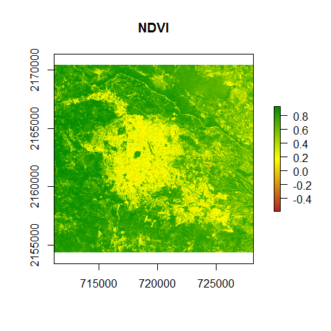<!-- -->

## Convert the DN contained in a Landsat 8 TIR band (10) to TOA brightness temperature employing the radiance multiplicative and additive band rescaling factors and K1 and K2 constants, according to USGS (2019)

``` r
br <- br_temp(tir, conv = TRUE, mult = 0.0003342, add = 0.1, k1 = 774.89, k2 = 1321.08)
plot(br, col=brewer.pal(9, 'YlOrRd'), main = "Brightness temperature (°C)")
```

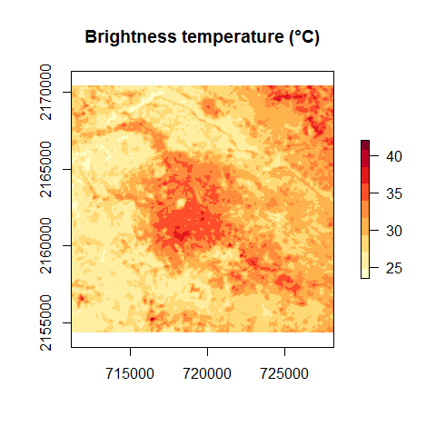<!-- -->

## Compute the per-pixel land surface emissivity employing the NDVI threshold method (Sobrino et al., 2008)

``` r
emis <- emissivity(veg, enonveg = 0.95, eveg = 0.99, pveg = FALSE)
plot(emis[[1]], main = "Emissivity", col=colorRampPalette(c("white", "black"))(255))
```

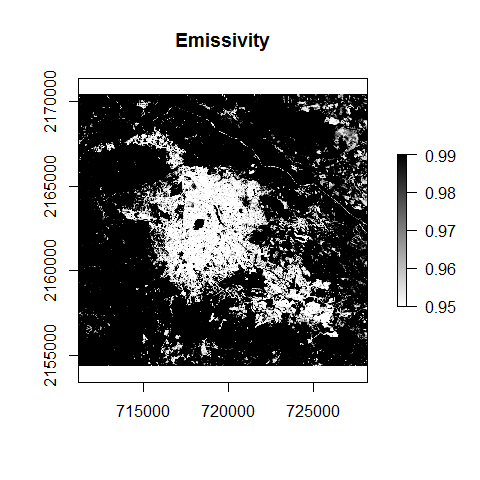<!-- -->

## Compute LST based on the inversion of the Planck function employing the brightness temperature and emissivity bands, according to USGS (2019)

``` r
lst <- landsat_lst(br, emis, sensor = "L8", conv = FALSE)
plot(lst, col=brewer.pal(9, 'YlOrRd'), main = "LST (°C)")
```

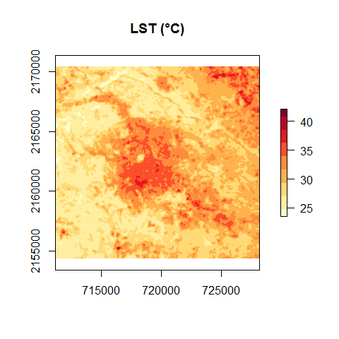<!-- -->

## Compute hot and cold spots analysis based on the Getis-Ord Gi\* statistic (Getis and Ord, 1996) and the False Discovery Rate (FDR) correction (Benjamini and Hochberg, 1995)

``` r

# Subset extent to avoid time-consuming test
e <- as(extent(716747.19, 719585.16, 2160408.248, 2163349.293), 'SpatialPolygons') 
crs(e) <- crs(lst)
lst_e <- crop(lst, e)

# Compute Getis-Ord Gi* statistic
spots <- getis(lst_e, dist = 65, p = 0.05)

# Aggregate by cluster type and plot with proper colors
r <- aggregate(spots, by = "cluster")
r$color <- ifelse(r$cluster == "Hot spot", "red", #colors for plotting
                  ifelse(r$cluster == "Cold spot", "blue", "grey"))
{plot(r, col=r$color, border=NA, axes=F, main = "Hot-cold spots")  #border="gray50" #plot
legend("bottom", ncol = 3, fill=r$color, legend = c("Cold", "Hot", "No sig."))}
```

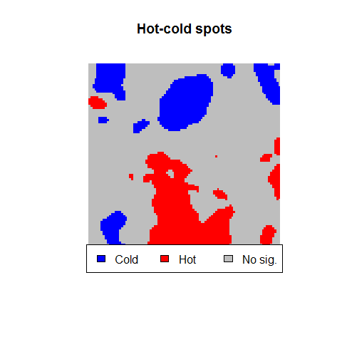<!-- -->

## Filter MODIS LST from a .hdf file according to Wan (2013) and Gawuc and Struzewska (2016)

``` r
# Load the MOD11A1 LST and Emissivity MODIS product
data(mod11a1)

# For LST day MOD11A1 product, filtering pixels with LST error <= 1 and view zenith angle <= 35
r <- lst_filter(mod11a1, time = "day", flag  = 1, angle = 35, conv = TRUE)
plot(r[[1]], col=brewer.pal(9, 'YlOrRd'), main = "Filtered LST (°C)")
```

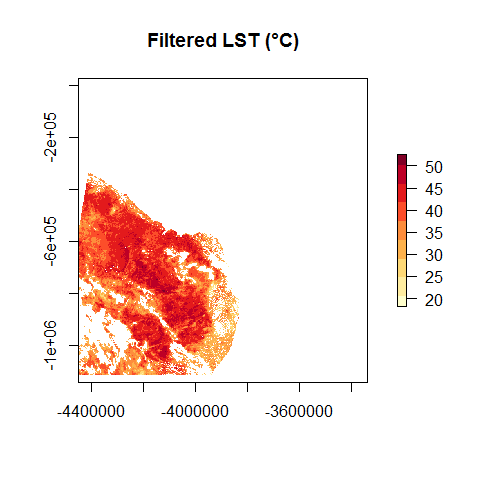<!-- -->

``` r
plot(r[[2]], main = "LST error (°C)")
```

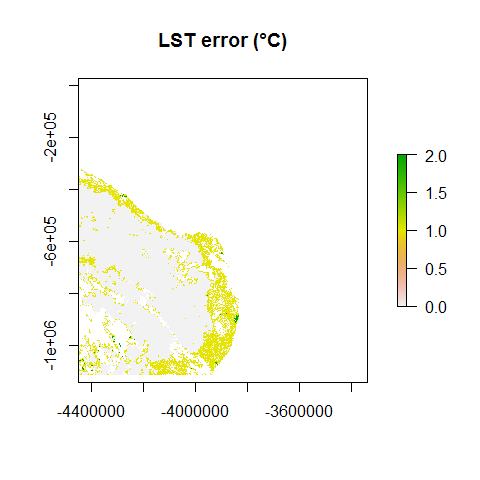<!-- -->

``` r
plot(r[[3]], main = "Viewing zenith angle (°)")
```

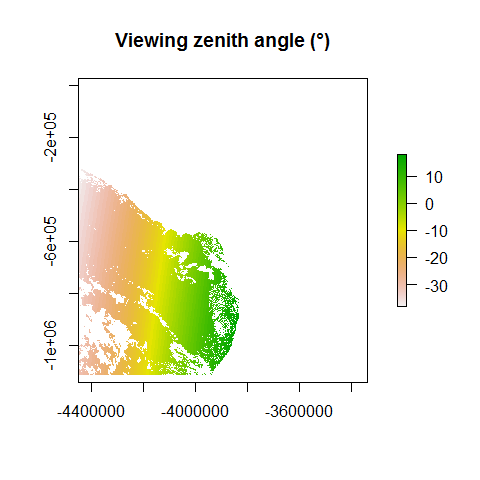<!-- -->

## Filter MODIS vegetation index from a .hdf file according to Didan et al. (2005)

``` r
# Load the MOD13A1 vegetation index MODIS product
data(mod13a1)

# For NDVI MOD13Q1 product, filtering pixels with usefulness <= 2 and view zenith angle <= 35
v <- veg_filter(mod13a1, vi = "NDVI", rel = FALSE, usef = 2, angle = 35)
plot(v[[1]], col=rev(colorRampPalette(c("green4", "yellow", "firebrick"))(255)), main = "Filtered NDVI")
```

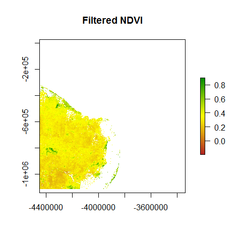<!-- -->

``` r
plot(v[[2]], main = "Reliability")
```

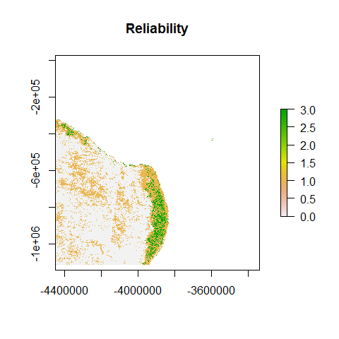<!-- -->

``` r
plot(v[[3]], main = "Usefulness")
```

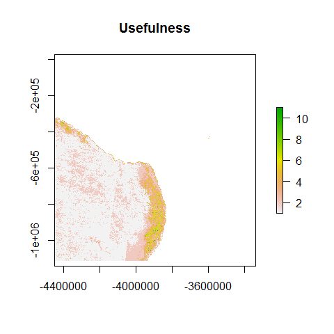<!-- -->

``` r
plot(v[[4]], main = "Viewing zenith angle (°)")
```

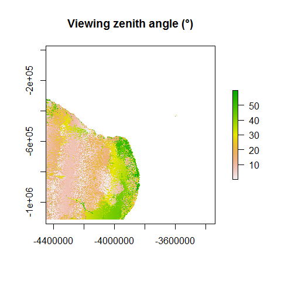<!-- -->

## References

Benjamini, Y., and Hochberg, Y. (1995). Controlling the false discovery
rate: a practical and powerful approach to multiple testing. Journal of
the Royal Statistical Society Series B, 57, 289–300.

Didan, K. Barreto-Munoz, A., Solano, R. & Huete, A. (2015). MODIS
Vegetation Index User’s Guide (MOD13 Series) Collection-6. Arizona, USA,
32.

Gawuc, L., & Struzewska, J. (2016). Impact of MODIS quality control on
temporally aggregated urban surface temperature and long-term surface
urban heat island intensity. Remote Sensing, 8(5).

Getis, A. and Ord, J. K. (1996). Local spatial statistics: an overview.
In P. Longley and M. Batty (eds) Spatial analysis: modelling in a GIS
environment (Cambridge: Geoinformation International), 261–277.

Rouse, J.W., R.H. Haas, J.A. Schell, and D.W. Deering. (1974).
Monitoring vegetation systems in the Great Plains with ERTS, In: S.C.
Freden, E.P. Mercanti, and M. Becker (eds) Third Earth Resources
Technology Satellite–1 Syposium. Volume I: Technical Presentations, NASA
SP-351, NASA, Washington, D.C., pp. 309-317.

Sobrino, J. A., Jiménez-Muñoz, J. C., Sòria, G., Romaguera, M., Guanter,
L., Moreno, J. & Martínez, P. (2008). Land surface emissivity retrieval
from different VNIR and TIR sensors. IEEE Transactions on Geoscience and
Remote Sensing, 46(2): 316–327.

USGS. (2019). Landsat 8 data users handbook version 4. USGS Earth
Resources Observation and Science (EROS). Sioux Falls, South Dakota.
USA. 106.

Wan, Z. (2013). Collection-6 MODIS Land Surface Temperature Products
User’s guide. Santa Barbara, USA, 33.
